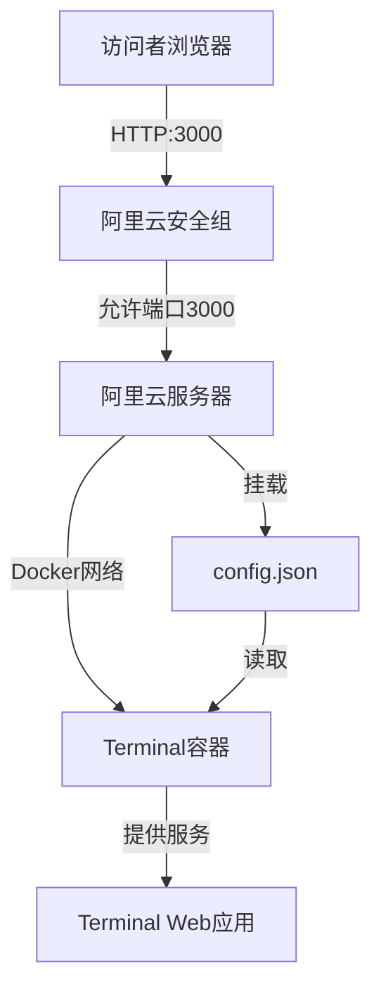

# 设计文档

## 概述

本设计文档描述了如何在阿里云服务器上使用 Docker 部署 m4tt72/terminal 黑客终端风格个人网站的技术实现方案。该方案采用 Docker Compose 进行容器编排，通过配置文件挂载实现个性化定制，确保部署过程简单、可重复且易于维护。

## 架构

### 系统架构图



### 部署架构

- **宿主机层**: 阿里云 ECS 服务器，运行 Docker Engine 和 Docker Compose
- **容器层**: 单个 Docker 容器运行 m4tt72/terminal 应用
- **配置层**: 本地 config.json 文件通过卷挂载注入容器
- **网络层**: 端口映射 3000:3000，通过阿里云安全组控制访问

## 组件和接口

### 1. Docker Compose 配置文件 (docker-compose.yml)

**职责**: 定义容器服务、端口映射、卷挂载和重启策略

**配置结构**:
```yaml
version: '3.8'
services:
  terminal:
    image: m4tt72/terminal:latest
    container_name: terminal-portfolio
    ports:
      - "3000:3000"
    volumes:
      - ./config.json:/usr/src/app/public/config.json:ro
    restart: unless-stopped
```

**关键配置项**:
- `image`: 使用官方最新镜像 `m4tt72/terminal:latest`
- `container_name`: 指定容器名称为 `terminal-portfolio` 便于管理
- `ports`: 将容器内部端口 3000 映射到宿主机端口 3000
- `volumes`: 以只读模式挂载本地 config.json 到容器指定路径
- `restart`: 设置为 `unless-stopped` 确保容器自动重启（除非手动停止）

### 2. 终端配置文件 (config.json)

**职责**: 定义终端外观、个人信息、自定义命令和社交链接

**配置结构**:
```json
{
  "bioTextLines": [
    "行1",
    "行2"
  ],
  "ps1_hostname": "WangJian",
  "ps1_username": "root",
  "repo": "https://github.com/用户名",
  "social": {
    "github": "用户名",
    "email": "邮箱地址"
  },
  "commands": [
    {
      "name": "命令名",
      "description": "命令描述",
      "usage": "命令用法",
      "output": "命令输出"
    }
  ]
}
```

**个性化配置内容**:

1. **终端提示符配置**:
   - `ps1_username`: "root"
   - `ps1_hostname`: "WangJian"
   - 显示效果: `root@WangJian:~$`

2. **个人简介 (bioTextLines)**:
   ```
   嗨！我是 Wang Jian（王健），21岁的自学开发者
   专注于 DevOps 工程和自动化，目标是成为"最强程序员"
   热衷于 Linux 服务器维护、Docker 容器化和 Python 自动化
   对 AI 技术和系统优化充满热情，持续探索技术边界
   ```

3. **社交链接**:
   - GitHub: `https://github.com/[YOUR_USERNAME]`
   - Email: `your.email@example.com`

4. **自定义命令**:

   **skills 命令**:
   - 描述: "显示我的技术技能栈"
   - 输出: 列出 Linux、Docker、Nginx、Python、Traffic Analysis

   **projects 命令**:
   - 描述: "查看我的项目经验"
   - 输出: 介绍 Qinglong Auto-Watchdog 项目（自动修复青龙面板内存泄漏的监控脚本）

   **services 命令**:
   - 描述: "我提供的技术服务"
   - 输出: 列出三项服务
     * Server Rescue (CPU/OOM fix) - 服务器紧急救援
     * Script Setup - 自动化脚本配置
     * Environment Deployment - 环境部署服务

### 3. 部署脚本和命令

**职责**: 提供一键部署和管理命令

**目录结构创建**:
```bash
mkdir -p ~/terminal-website
cd ~/terminal-website
```

**文件创建命令**:
```bash
# 创建 docker-compose.yml
cat > docker-compose.yml << 'EOF'
[配置内容]
EOF

# 创建 config.json
cat > config.json << 'EOF'
[配置内容]
EOF
```

**容器管理命令**:
```bash
# 启动容器
docker-compose up -d

# 查看容器状态
docker-compose ps

# 查看日志
docker-compose logs -f

# 停止容器
docker-compose down

# 重启容器
docker-compose restart
```

## 数据模型

### Config.json 数据结构

```typescript
interface TerminalConfig {
  bioTextLines: string[];           // 个人简介文本行数组
  ps1_hostname: string;              // 终端主机名
  ps1_username: string;              // 终端用户名
  repo: string;                      // GitHub 仓库 URL
  social: {
    github: string;                  // GitHub 用户名
    email: string;                   // 电子邮件地址
  };
  commands: Command[];               // 自定义命令数组
}

interface Command {
  name: string;                      // 命令名称
  description: string;               // 命令描述
  usage?: string;                    // 命令用法（可选）
  output: string | string[];         // 命令输出（字符串或字符串数组）
}
```

### Docker Compose 服务定义

```typescript
interface DockerComposeService {
  image: string;                     // Docker 镜像名称
  container_name: string;            // 容器名称
  ports: string[];                   // 端口映射数组
  volumes: string[];                 // 卷挂载数组
  restart: string;                   // 重启策略
}
```

## 正确性属性

*属性是一种特征或行为，应该在系统的所有有效执行中保持为真——本质上是关于系统应该做什么的形式化陈述。属性作为人类可读规范和机器可验证正确性保证之间的桥梁。*


### 属性 1: Docker Compose 配置完整性
*对于任何* 生成的 docker-compose.yml 文件，解析后应包含以下所有必需字段：image 字段值为 "m4tt72/terminal"，ports 数组包含 "3000:3000"，volumes 数组包含到 config.json 的挂载路径，restart 字段设置为有效的重启策略
**验证需求: 1.1, 1.2, 1.3, 1.4, 7.1**

### 属性 2: YAML 格式有效性
*对于任何* 生成的 docker-compose.yml 文件，使用 YAML 解析器解析时应成功返回有效的数据结构而不抛出语法错误
**验证需求: 1.5**

### 属性 3: 终端提示符配置正确性
*对于任何* 生成的 config.json 文件，解析后应包含 ps1_username 字段值为 "root" 且 ps1_hostname 字段值为 "WangJian"
**验证需求: 2.1**

### 属性 4: 个人简介内容完整性
*对于任何* 生成的 config.json 文件，bioTextLines 数组应包含以下所有关键信息：年龄 "21"，角色关键词 "DevOps" 和 "Automation"，目标 "最强程序员"，技术关键词 "AI" 和 "Linux"
**验证需求: 2.2, 4.1, 4.2, 4.3**

### 属性 5: 社交链接字段存在性
*对于任何* 生成的 config.json 文件，解析后应包含 social 对象，且该对象包含 github 和 email 字段
**验证需求: 2.3**

### 属性 6: Skills 命令完整性
*对于任何* 生成的 config.json 文件，commands 数组应包含名为 "skills" 的命令，且该命令的输出包含所有五项技能：Linux、Docker、Nginx、Python、Traffic Analysis，并使用列表格式（包含换行符）
**验证需求: 2.4, 4.4, 8.1**

### 属性 7: Projects 命令完整性
*对于任何* 生成的 config.json 文件，commands 数组应包含名为 "projects" 的命令，且该命令的输出包含项目名称 "Qinglong Auto-Watchdog" 和核心功能描述（包含 "内存泄漏" 或 "memory leak"）
**验证需求: 2.5, 4.5, 8.2**

### 属性 8: Services 命令完整性
*对于任何* 生成的 config.json 文件，commands 数组应包含名为 "services" 的命令，且该命令的输出包含三项服务：Server Rescue、Script Setup、Environment Deployment，并使用列表格式（包含换行符）
**验证需求: 2.6, 4.6, 8.3**

### 属性 9: JSON 格式有效性
*对于任何* 生成的 config.json 文件，使用 JSON 解析器解析时应成功返回有效的数据结构而不抛出语法错误
**验证需求: 2.7**

### 属性 10: 相对路径使用
*对于任何* 生成的 docker-compose.yml 文件，volumes 配置中的本地路径应使用相对路径（以 "./" 开头）而不是绝对路径
**验证需求: 5.4**

### 属性 11: 输出格式可读性
*对于任何* 生成的 config.json 文件中的命令输出，如果输出包含多个项目，应使用换行符（\n）分隔以确保可读性
**验证需求: 8.4**

## 错误处理

### 配置文件错误

**场景**: config.json 格式错误或缺少必需字段

**处理策略**:
- 在部署指南中提供 JSON 验证命令：`python -m json.tool config.json`
- 提供常见错误排查步骤（缺少逗号、引号不匹配等）
- 建议使用在线 JSON 验证工具进行检查

### Docker 相关错误

**场景 1**: Docker 或 Docker Compose 未安装

**处理策略**:
- 在部署指南中添加前置条件检查命令
- 提供 Docker 和 Docker Compose 安装指南链接
- 检查命令：`docker --version && docker-compose --version`

**场景 2**: 端口 3000 已被占用

**处理策略**:
- 提供端口占用检查命令：`lsof -i :3000` 或 `netstat -tuln | grep 3000`
- 说明如何修改端口映射（同时修改 docker-compose.yml 和安全组配置）
- 提供停止占用进程的指导

**场景 3**: 权限不足

**处理策略**:
- 说明需要 Docker 用户组权限或 sudo 权限
- 提供添加用户到 docker 组的命令：`sudo usermod -aG docker $USER`
- 提醒需要重新登录以使权限生效

### 网络访问错误

**场景**: 无法从外部访问网站

**处理策略**:
- 提供阿里云安全组配置检查清单
- 确认入站规则包含端口 3000
- 提供本地测试命令：`curl http://localhost:3000`
- 提供防火墙检查命令（如适用）

### 容器启动失败

**场景**: 容器无法启动或立即退出

**处理策略**:
- 提供日志查看命令：`docker-compose logs terminal`
- 检查 config.json 挂载是否成功
- 验证镜像是否成功拉取：`docker images | grep m4tt72/terminal`
- 提供重新拉取镜像的命令：`docker-compose pull`

## 测试策略

### 双重测试方法

本项目采用单元测试和基于属性的测试相结合的方法：

- **单元测试**: 验证特定示例、边缘情况和错误条件
- **基于属性的测试**: 验证所有输入的通用属性

两者互补，共同确保全面覆盖（单元测试捕获具体错误，属性测试验证通用正确性）。

### 单元测试策略

**配置文件验证测试**:
- 测试 docker-compose.yml 包含正确的镜像名称
- 测试 config.json 包含所有必需的命令
- 测试社交链接占位符存在
- 测试个人信息关键词存在

**文件格式测试**:
- 测试 YAML 文件可以成功解析
- 测试 JSON 文件可以成功解析
- 测试配置文件符合预期的数据结构

**部署指南测试**:
- 测试指南包含所有必需的命令
- 测试命令语法正确（无明显错误）
- 测试 URL 格式说明存在

### 基于属性的测试策略

**测试库选择**: 根据实现语言选择合适的属性测试库
- Python: Hypothesis
- JavaScript/TypeScript: fast-check
- Go: gopter
- Rust: proptest

**测试配置**:
- 每个属性测试最少运行 100 次迭代
- 每个测试必须引用设计文档中的属性
- 标签格式: **Feature: terminal-portfolio-deployment, Property {number}: {property_text}**

**属性测试用例**:

1. **属性 1 测试**: Docker Compose 配置完整性
   - 生成 docker-compose.yml 文件
   - 解析并验证所有必需字段存在且值正确
   - 标签: **Feature: terminal-portfolio-deployment, Property 1: Docker Compose 配置完整性**

2. **属性 2 测试**: YAML 格式有效性
   - 生成 docker-compose.yml 文件
   - 使用 YAML 解析器解析，验证无语法错误
   - 标签: **Feature: terminal-portfolio-deployment, Property 2: YAML 格式有效性**

3. **属性 3 测试**: 终端提示符配置正确性
   - 生成 config.json 文件
   - 解析并验证 ps1_username 和 ps1_hostname 字段值
   - 标签: **Feature: terminal-portfolio-deployment, Property 3: 终端提示符配置正确性**

4. **属性 4 测试**: 个人简介内容完整性
   - 生成 config.json 文件
   - 验证 bioTextLines 包含所有必需的关键信息
   - 标签: **Feature: terminal-portfolio-deployment, Property 4: 个人简介内容完整性**

5. **属性 5 测试**: 社交链接字段存在性
   - 生成 config.json 文件
   - 验证 social 对象及其字段存在
   - 标签: **Feature: terminal-portfolio-deployment, Property 5: 社交链接字段存在性**

6. **属性 6 测试**: Skills 命令完整性
   - 生成 config.json 文件
   - 验证 skills 命令存在且输出包含所有技能
   - 标签: **Feature: terminal-portfolio-deployment, Property 6: Skills 命令完整性**

7. **属性 7 测试**: Projects 命令完整性
   - 生成 config.json 文件
   - 验证 projects 命令存在且输出包含项目信息
   - 标签: **Feature: terminal-portfolio-deployment, Property 7: Projects 命令完整性**

8. **属性 8 测试**: Services 命令完整性
   - 生成 config.json 文件
   - 验证 services 命令存在且输出包含所有服务
   - 标签: **Feature: terminal-portfolio-deployment, Property 8: Services 命令完整性**

9. **属性 9 测试**: JSON 格式有效性
   - 生成 config.json 文件
   - 使用 JSON 解析器解析，验证无语法错误
   - 标签: **Feature: terminal-portfolio-deployment, Property 9: JSON 格式有效性**

10. **属性 10 测试**: 相对路径使用
    - 生成 docker-compose.yml 文件
    - 验证 volumes 配置使用相对路径
    - 标签: **Feature: terminal-portfolio-deployment, Property 10: 相对路径使用**

11. **属性 11 测试**: 输出格式可读性
    - 生成 config.json 文件
    - 验证多项输出使用换行符分隔
    - 标签: **Feature: terminal-portfolio-deployment, Property 11: 输出格式可读性**

### 集成测试策略

虽然不在自动化测试范围内，但建议进行以下手动集成测试：

1. **端到端部署测试**:
   - 在干净的阿里云服务器上执行完整部署流程
   - 验证容器成功启动
   - 验证网站可以从外部访问

2. **容器生命周期测试**:
   - 测试容器重启后配置保持不变
   - 测试服务器重启后容器自动启动
   - 测试容器异常退出后自动重启

3. **功能验证测试**:
   - 在浏览器中访问网站
   - 执行所有自定义命令（skills、projects、services）
   - 验证输出格式和内容正确

### 测试覆盖率目标

- 配置文件生成逻辑：100% 代码覆盖率
- 所有正确性属性：100% 属性测试覆盖
- 关键部署命令：手动验证测试
