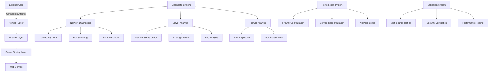

# Design Document: Website Accessibility Fix

## Overview

This design provides a systematic approach to diagnose and resolve website accessibility issues where external users receive "ERR_CONNECTION_REFUSED" errors while the owner can access the site. The solution implements a multi-layered diagnostic and remediation system that addresses network connectivity, server configuration, firewall rules, and service binding issues.

The core problem typically stems from web services being bound to localhost (127.0.0.1) instead of all interfaces (0.0.0.0), restrictive firewall rules blocking external traffic, or network configuration issues preventing external access.

## Architecture

The solution follows a diagnostic-first approach with automated remediation capabilities:



## Components and Interfaces

### 1. Network Diagnostic Engine

**Purpose**: Systematically test network connectivity from external sources to identify connectivity barriers.

**Key Functions**:
- `ping_test(target_ip)`: Basic ICMP connectivity test
- `port_scan(target_ip, ports)`: Check port accessibility
- `traceroute_analysis(target_ip)`: Network path analysis
- `dns_resolution_test(domain)`: Verify DNS resolution

**Interfaces**:
- Input: Target IP address, port ranges, test parameters
- Output: Connectivity status, accessible ports, network path information

### 2. Server Configuration Analyzer

**Purpose**: Examine server-side configurations that affect external accessibility.

**Key Functions**:
- `check_service_binding()`: Identify which interfaces services are bound to
- `analyze_service_status()`: Verify web service operational status
- `parse_server_logs()`: Extract relevant error patterns and connection attempts
- `identify_configuration_files()`: Locate and analyze web server configuration files

**Interfaces**:
- Input: Server access credentials, service names, log file paths
- Output: Service binding status, configuration issues, log analysis results

### 3. Firewall Rule Manager

**Purpose**: Analyze and configure firewall rules to enable proper web traffic flow.

**Key Functions**:
- `audit_firewall_rules()`: Examine current firewall configuration
- `configure_web_ports()`: Open necessary ports (80, 443) for web traffic
- `apply_security_rules()`: Implement secure but accessible firewall rules
- `validate_rule_changes()`: Confirm firewall changes are effective

**Interfaces**:
- Input: Current firewall configuration, required ports, security policies
- Output: Updated firewall rules, rule change status, security validation results

### 4. Service Configuration Manager

**Purpose**: Modify web service configurations to accept external connections.

**Key Functions**:
- `update_binding_configuration()`: Change service binding from localhost to all interfaces
- `backup_original_config()`: Create backups before making changes
- `restart_services()`: Safely restart web services with new configurations
- `validate_service_accessibility()`: Confirm services accept external connections

**Interfaces**:
- Input: Service configuration files, binding parameters, restart policies
- Output: Updated configurations, service status, accessibility confirmation

### 5. Comprehensive Test Framework

**Purpose**: Validate website accessibility from multiple external sources and scenarios.

**Key Functions**:
- `multi_source_accessibility_test()`: Test from various external networks and devices
- `cross_platform_validation()`: Verify access across different operating systems and browsers
- `load_testing()`: Ensure server handles multiple simultaneous connections
- `regression_testing()`: Confirm owner access remains functional

**Interfaces**:
- Input: Test scenarios, target URLs, performance criteria
- Output: Accessibility test results, performance metrics, compatibility reports

## Data Models

### DiagnosticResult
```
DiagnosticResult {
  timestamp: DateTime
  test_type: String
  source_location: String
  target_ip: String
  status: ConnectionStatus
  response_time: Number
  error_details: String
  recommendations: List<String>
}
```

### ServerConfiguration
```
ServerConfiguration {
  service_name: String
  binding_address: String
  listening_ports: List<Number>
  configuration_file_path: String
  status: ServiceStatus
  last_modified: DateTime
  backup_path: String
}
```

### FirewallRule
```
FirewallRule {
  rule_id: String
  direction: TrafficDirection
  protocol: String
  port_range: String
  source_address: String
  destination_address: String
  action: RuleAction
  priority: Number
}
```

### TestResult
```
TestResult {
  test_id: String
  test_type: TestType
  source_device: String
  source_network: String
  target_url: String
  success: Boolean
  response_code: Number
  response_time: Number
  error_message: String
  timestamp: DateTime
}
```

## Correctness Properties

*A property is a characteristic or behavior that should hold true across all valid executions of a system—essentially, a formal statement about what the system should do. Properties serve as the bridge between human-readable specifications and machine-verifiable correctness guarantees.*

### Property 1: Comprehensive Network Diagnostics
*For any* target server and external testing source, the diagnostic system should accurately identify network connectivity status, accessible ports, DNS resolution, and network path information
**Validates: Requirements 1.1, 1.2, 1.3, 1.4, 1.5**

### Property 2: Server Configuration Analysis Accuracy
*For any* server configuration, the analysis system should correctly identify service binding interfaces, service status, log patterns, localhost-only binding issues, and process states
**Validates: Requirements 2.1, 2.2, 2.3, 2.4, 2.5**

### Property 3: Firewall Rule Management Correctness
*For any* firewall configuration, the firewall manager should accurately analyze current rules, configure web ports for external access, apply secure rules, and validate changes take effect immediately
**Validates: Requirements 3.1, 3.2, 3.3, 3.4, 3.5**

### Property 4: Service Configuration Management Reliability
*For any* web service configuration, the configuration manager should properly bind services to all interfaces, restart services with new configurations, create backups before changes, handle multiple services consistently, and validate external connection acceptance
**Validates: Requirements 4.1, 4.2, 4.3, 4.4, 4.5**

### Property 5: Comprehensive Testing Framework Validation
*For any* website accessibility scenario, the test framework should verify access from multiple external sources, handle load testing, validate cross-platform compatibility, test from different network locations, and ensure regression testing preserves original functionality
**Validates: Requirements 5.1, 5.2, 5.3, 5.4, 5.5**

### Property 6: Security Preservation During Access Enablement
*For any* configuration change that enables external access, the security validator should ensure no new vulnerabilities are introduced, maintain protection against unauthorized access, verify only intended services are exposed, recommend protective measures for identified risks, and document all security implications
**Validates: Requirements 6.1, 6.2, 6.3, 6.4, 6.5**

### Property 7: Documentation and Monitoring Completeness
*For any* system change or monitoring setup, the documentation system should record all modifications with timestamps and rationale, establish monitoring for external accessibility, configure appropriate alerts, provide step-by-step troubleshooting procedures, and include preventive maintenance checks
**Validates: Requirements 7.1, 7.2, 7.3, 7.4, 7.5**

## Error Handling

The system implements comprehensive error handling across all diagnostic and remediation operations:

### Network-Level Error Handling
- **Connection Timeouts**: Implement configurable timeout values with retry mechanisms
- **DNS Resolution Failures**: Provide fallback DNS servers and detailed error reporting
- **Network Unreachable**: Distinguish between temporary and permanent network issues
- **Port Blocking**: Identify specific ports blocked and suggest alternative configurations

### Server Configuration Error Handling
- **Permission Denied**: Handle insufficient privileges for configuration access gracefully
- **Configuration File Corruption**: Validate configuration files before modification and maintain backups
- **Service Restart Failures**: Implement rollback mechanisms for failed service restarts
- **Binding Conflicts**: Detect and resolve port binding conflicts between services

### Firewall Configuration Error Handling
- **Rule Application Failures**: Validate firewall rules before application and provide detailed error messages
- **Permission Issues**: Handle cases where firewall modification requires elevated privileges
- **Rule Conflicts**: Detect and resolve conflicting firewall rules automatically
- **Backup and Recovery**: Maintain firewall rule backups for emergency rollback

### Validation and Testing Error Handling
- **Test Execution Failures**: Provide detailed failure analysis and suggested remediation steps
- **False Positives/Negatives**: Implement multiple validation methods to reduce test result errors
- **Resource Exhaustion**: Handle cases where testing consumes excessive system resources
- **External Dependency Failures**: Gracefully handle failures in external testing services

## Testing Strategy

The testing approach combines unit testing for specific scenarios with property-based testing for comprehensive validation across all possible inputs and configurations.

### Unit Testing Focus Areas
- **Specific Error Scenarios**: Test known error conditions like "ERR_CONNECTION_REFUSED"
- **Configuration Edge Cases**: Test edge cases in server and firewall configurations
- **Integration Points**: Test interactions between diagnostic, remediation, and validation components
- **Security Boundary Conditions**: Test security validation at the boundaries of acceptable configurations

### Property-Based Testing Configuration
- **Testing Framework**: Use Hypothesis (Python) or fast-check (JavaScript) for property-based testing
- **Test Iterations**: Minimum 100 iterations per property test to ensure comprehensive coverage
- **Input Generation**: Generate diverse network configurations, server setups, and firewall rules
- **Shrinking**: Utilize automatic test case shrinking to identify minimal failing examples

### Test Environment Requirements
- **Isolated Test Networks**: Use containerized or virtualized environments for safe testing
- **Multiple Platform Testing**: Test across different operating systems and network configurations
- **External Access Simulation**: Simulate various external network conditions and restrictions
- **Security Testing**: Include penetration testing to validate security preservation

### Continuous Validation
- **Automated Regression Testing**: Run full test suite on any configuration changes
- **Performance Monitoring**: Track system performance during diagnostic and remediation operations
- **Security Scanning**: Continuous security validation of all configuration changes
- **Accessibility Monitoring**: Ongoing monitoring of website accessibility from external sources

The dual testing approach ensures both specific known issues are handled correctly (unit tests) and the system behaves correctly across all possible scenarios (property tests), providing comprehensive validation of the website accessibility fix solution.